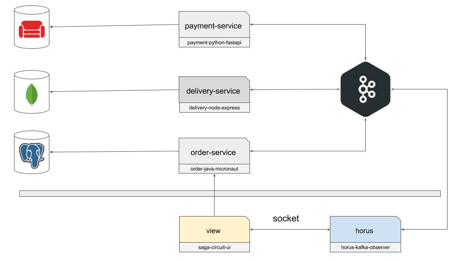
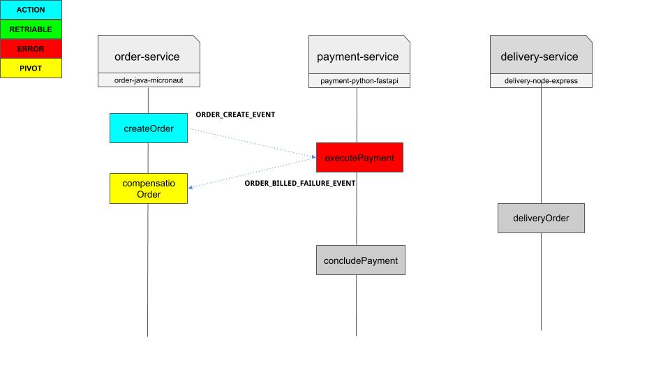

# View


# Flow

## Success


## Error




# Aplicações

### bff-kafka-observer

* Apenas observar os eventos do kafka e manda pra interface via socket

### delivery-node-express

* Faz a entrega do pedido. Puramente para testar fluxo com retentativa.
* Feito com nodejs + express + mongo + kafka.

### front-saga-circuit

* Interface para testar os possíveis fluxos
* Feito com js + sass + parsel + socket.io.

### order-golang

* Responsável pela criação e cancelamento (via fluxo de compensação) de pedido.
* Feito com golang (go) + postgresql + kafka.

### payment-python-fastapi

* Responsável por confirmar o pagamento do pedido.
* Feito com payhton 3 + fastAPI + couchDB + kafka.

# LITTLE READ

https://cloudnweb.dev/2020/01/implementing-saga-pattern-in-nodejs-microservices/

https://blog.couchbase.com/saga-pattern-implement-business-transactions-using-microservices-part/

https://medium.com/@tomasz_96685/saga-pattern-and-microservices-architecture-d4b46071afcf

https://microservices.io/patterns/data/saga.html

https://livebook.manning.com/book/microservices-patterns/chapter-4/v-11/

# Utils

```
docker-compose exec kafka  \
  bash -c "kafka-console-producer.sh --broker-list localhost:9092 --topic ORDER_CREATE_EVENT"
```

```
docker-compose exec kafka  \
  bash -c "kafka-console-producer.sh --broker-list localhost:9092 --topic ORDER_BILLED_EVENT"
```

```
docker-compose exec kafka  \
  bash -c "kafka-console-producer.sh --broker-list localhost:9092 --topic ORDER_BILLED_EVENT"
```

```
docker-compose exec kafka  \
  bash -c "kafka-console-producer.sh --broker-list localhost:9092 --topic ORDER_DELIVERED_FAILURE_EVENT"
```

# youtube

[](https://www.youtube.com/watch?v=9xhZW3S3uWY&feature=youtu.be "title")

